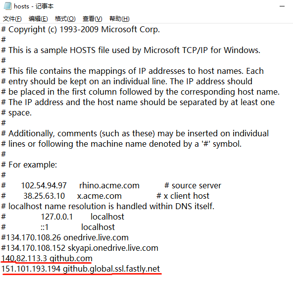

# **git命令实现文件上传下载**

---

## 1、git上传本地仓库到github

第一步：在需要上传的文件夹内`git bash here`

第二步：`git init`初始化

> (如果不是第一次，可省略)

第三步：`git add .`将当前目录下所有的文件全部加入队列

第四步：`git commit -m "commit info"`将当前目录文件全部commit

第五步：`git remote add origin https://github.com/dc4win/Web-.git`链接到远程仓库地址

> (如果不是第一次，可省略)

第六步：`git push -u origin master`将本地的 master 分支推送到 origin 主机的 master 分支

> 带上-u 参数其实就相当于记录了push到远端分支的默认值，这样当**下次我们还想要继续push的这个远端分支的时候推送命令就可以简写成*git push*即可**。	

## 2、git pull远程仓库

第一步：在本机目标文件夹内`git bash here`

第二步：`git init`初始化

> (如果不是第一次，可省略)

第三步：`git remote add origin https://github.com/dc4win/Web-.git`链接到远程仓库地址

> (如果不是第一次，可省略)

第四步：`git pull origin master`

## 常见错误或问题汇总

①`error: src refspec main does not match any error: failed to push some refs to 'https:*//github.com/surymy/vue-manage.git'*` 

> 错误原因：本地（一般是master）和gitub（一般是main）仓库名称不一样，导致不能关联
>
> 解决方法：在git push或pull前使用`git branch -m master main`来修改当前分支

②git速度非常慢，只有几kb甚至byte

> 错误原因：github.global.ssl.fastly.net域名被限制了
>
> 解决方法：在[ip查询网站](https://www.ipaddress.com/)查询`github.global.ssl.fastly.net` 以及`github.com`所对应的ip,并添加到hosts文件(目录：C:\Windows\System32\drivers\etc\hosts)，添加方式：
>
> 注意：搜索出github.global.ssl.fastly.net有四个ip，可以分别测试使用。
