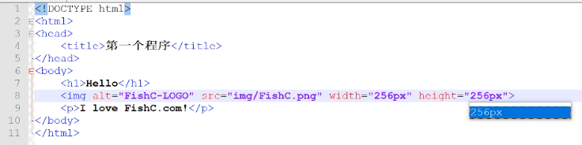
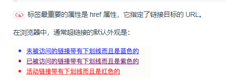
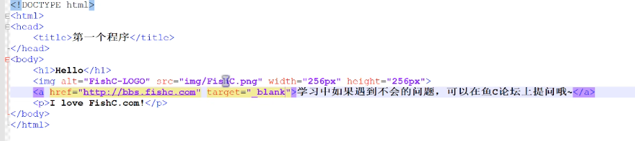
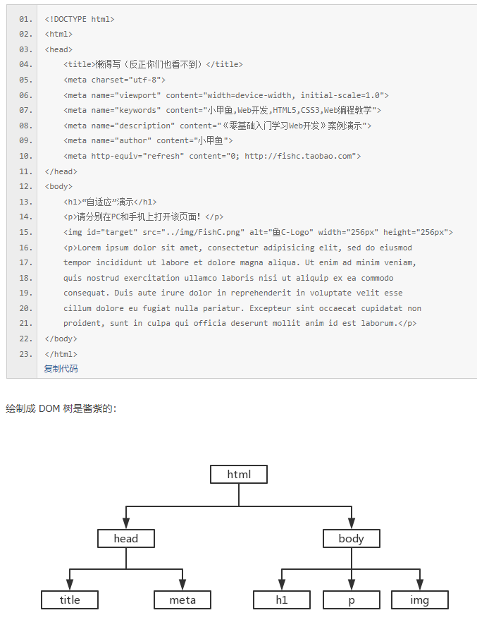

[TOC]

# <u>**小甲鱼web开发学习笔记**</u>

[markdown基础](https://github.com/Sakiyary/Markdown-Typora-VSCode-Doc)

[课堂案例演示](http://demo.fishc.com)

[HTML5速查宝典](http://man.fishc.com/html5)

[CSS3速查宝典](http://man.fishc.com/css3)

[课后作业](https://fishc.com.cn/forum.php?mod=forumdisplay&fid=354&filter=typeid&typeid=730)

---

## **第一课**

[视频教程](https://www.bilibili.com/video/BV1QW411N762/?p=3&spm_id_from=pageDriver&vd_source=bcc1d9a7193b5cc64f0719559c9e2c2f)

### 1、[html5声明](https://man.ilovefishc.com/pageHTML5/!DOCTYPE.html)

 `<!DOCTYPE html>`是一个声明，表示该文档是由 HTML5 进行编写的。

 在 HTML 4.01 中， 声明引用 DTD，因为 HTML 4.01 基于 SGML。DTD 规定了标记语言的规则，这样浏览器才能正确地呈现内容。

 HTML5 不基于 SGML，所以不需要引用 DTD。

 从html5开始到以后所有版本，声明将一直使用该格式


### 2、[标签`<head>`](https://man.ilovefishc.com/pageHTML5/head.html)

`<head>` 标签用于定义文档的头部，它是所有头部元素的容器。

`<head>` 中的元素可以引用脚本、指示浏览器在哪里找到样式表、提供元信息等等。

`<head>`标签中可使用的标签有：`<base>`,`<link>`,`<meta>`,`<script>`,`<title>`。

`<title>`是head部分中唯一必需的标签。

### 3、[标签`<title>`](https://man.ilovefishc.com/pageHTML5/title.html)

`<title>`标签用于定义文档的标题。

浏览器通常将其内容显示在浏览器窗口的标题栏或状态栏上。

如果把网页加入用户的链接列表或者收藏夹、书签列表，`<title>`元素的内容将成为该网页链接的默认名称。

### 4、[标签`<body>`](https://man.ilovefishc.com/pageHTML5/body.html)

`<body>`标签定义文档的主体。

body 元素包含文档的所有内容（比如文本、超链接、图像、表格和列表等等）。

### 5、[标签`<h1>-<h6>`](https://man.ilovefishc.com/pageHTML5/h.html)

`<h1>` - `<h6>` 标签可定义标题。

由于 h 元素拥有确切的语义，因此请慎重地选择恰当的标签层级来构建文档的结构。因此，**请不要利用标题标签来改变同一行中的字体大小**。

相反，应当使用层叠样式表定义来达到漂亮的显示效果。

### 6、[标签`<p>`](https://man.ilovefishc.com/pageHTML5/p.html)

`<p>`标签用于定义一个段落。

p 元素会自动在其前后创建一些空白。浏览器会自动添加这些空间，你也可以通过CSS样式表进行约束。

### 7、[标签``](https://man.ilovefishc.com/pageHTML5/img.html)

`` 标签用于向网页中嵌入一幅图像。从技术上讲，`` 标签并不会在网页中插入图像，而是从网页上链接图像。`` 标签创建的是被引用图像的占位空间。`` 标签有**两个必需的属性**：*src 属性* 和 *alt 属性*。**``没有结束标签**

#### 属性：

|   属性   |      值       |               描述               |
| :------: | :-----------: | :------------------------------: |
|   alt    |     text      |       指定图像的替代文本。       |
|   src    |      URL      |       指定显示图像的 URL。       |
|  width   | px(pixels)、% | 设置图像的宽度（像素或百分比）。 |
|  height  | px(pixels)、% | 定义图像的高度（像素或百分比）。 |
|  ismap   |      URL      |  将图像定义为服务器端图像映射。  |
| longdesc |      URL      | 指定包含长的图像描述文档的 URL。 |
|  usemap  |      URL      |  将图像定义为客户器端图像映射。  |

#### 范例：



### 8、[标签`<a>`](https://man.ilovefishc.com/pageHTML5/a.html)

`<a>` 标签用于定义**超链接**，超链接可以让用户从一个网页跳转到另一个网页。



#### 属性：

|   属性   |                   值                    |                             描述                             |
| :------: | :-------------------------------------: | :----------------------------------------------------------: |
| download |                filename                 |                   指定被下载的超链接目标。                   |
|   href   |                   URL                   |                   指定链接指向页面的 URL。                   |
| hreflang |              language_code              |                    指定被链接文档的语言。                    |
|  media   |               media_query               |           指定被链接文档是为何种媒介/设备优化的。            |
|   rel    |                  text                   |             规定当前文档与被链接文档之间的关系。             |
|  target  | _blank、_parent、_self、_top、framename | 指定在何处打开超链接。 _blank：在新窗口中打开 _parent：在当前的父窗口中打开，如果不存在父窗口，此选项的行为方式与 _self 等同 _self：当前窗口打开（默认） _top：在整个窗口中打开 framename：在指定的框架中打开 |
|   type   |                MIME type                |                指定被链接文档的的 MIME 类型。                |

#### 范例：



### [课后作业](https://fishc.com.cn/forum.php?mod=viewthread&tid=107172&extra=page%3D1%26filter%3Dtypeid%26typeid%3D730)

## 第二课：[<meta>标签的用法](https://man.ilovefishc.com/pageHTML5/meta.html)

### 1、定义

> `<meta>` 标签用于描述页面内容，关键词，作者，最新修订时间以及其它元信息。

`<meta>`标签内容被称为**元信息**，不会显示在网页中，但是可以被爬虫解析；

元信息可以作为设定浏览器加载显示的属性，也可以用于便于百度谷歌等搜索引擎收录。

### 2、属性

|    属性    |                              值                              |                             描述                             |
| :--------: | :----------------------------------------------------------: | :----------------------------------------------------------: |
|  charset   |                        character_set                         |                    指定 HTML 文档的编码。                    |
|  content   |                             text                             |         指定与 `http-equiv` 或 `name` 属性相关的值。         |
| http-equiv |             content-type、default-style、refresh             | content-type：另一种声明 HTML 文档作用字符编码的方法（`<meta http-equiv="content-type" content="text/html charset=UTF-8">`）。 default-style：指定页面优先使用的样式表。 refresh：以秒为单位指定一个时间间隔，在此时间过去之后将从服务器重新载入当前页面。也可以另行指定一个 URL 让浏览器载入。 |
|    name    | application-name、author、description、generator、keywords、viewport | application-name：当前页所属 Web 应用系统的名称。 author：当前页的作者名。 description：当前页的内容描述。 generator：用来生成 HTML 的软件名称。 keywords：当前页的关键词。 viewport：网页尺寸自适应。 |

### 3、注意事项

> `<meta>`标签位于`<head>`标签内部；
>
> **在写`<name>`或者`<http-equiv>`属性后必须加上`<content>`属性**
>
> 想要实现网页尺寸在各终端上的自适应显示，应该通过`<meta>`设置如下：
>
> ```html
> <meta name="viewport" content="width=device-width,initial-scale=1.0">
> ```

### 4、实例

实例1：指定网页编码**（重要！没有此元信息会导致上传到服务器端的网页中文乱码）**

```html
<meta charset="UTF-8">
```

实例2：为搜索引擎提供关键词便于搜索

```html
<meta name="keywords" content="web开发,html5,编程">
```

实例3：描述网页内容

```html
<meta name="descrption" content="学习web开发的好玩意儿">
```

实例4：定义网页作者

```html
<meta name="author",content="DC">
```

实例5：设置网页在各终端自适应显示

```html
<meta name="viewport" content="width=device-width,initial-scale=1.0">
```

实例6：设置每3秒就自动刷新并跳转到百度

```html
<meta http-equiv="refresh" content="3;https://www.baidu.com/">
```

### [课后作业](https://www.baidu.com/)

1、操作系统是使用反斜杠（\）做分隔符，在 HTML 中，我们可以使用它来代替斜杠（/）吗？

> 答案：不能！路径只能用斜杠(/)作为分隔符。

2、实例5中content中参数是什么含义？

> 答案：`<width=device-width>`意思是获取当前设备的屏幕宽度并按此进行页面设置；`<initial-scale=1.0>`表示该页面初始加载时，页面的缩放级别。

3、学会绘制DOM树



4、动手练习：实现网页尺寸自适应；添加关键词、内容描述、作者信息；实现一个带超链接的图片
