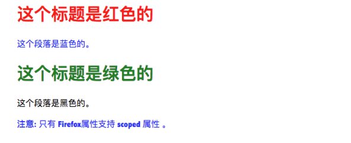
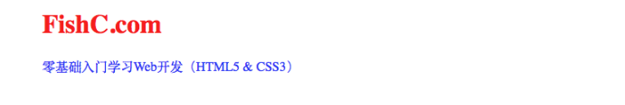

[TOC]

# <u>**小甲鱼web开发学习笔记**</u>

[markdown基础](https://github.com/Sakiyary/Markdown-Typora-VSCode-Doc)

[课堂案例演示](http://demo.fishc.com)

[HTML5速查宝典](http://man.fishc.com/html5)

[CSS3速查宝典](http://man.fishc.com/css3)

[课后作业](https://fishc.com.cn/forum.php?mod=forumdisplay&fid=354&filter=typeid&typeid=730)

---

## **第一课**

[视频教程](https://www.bilibili.com/video/BV1QW411N762/?p=3&spm_id_from=pageDriver&vd_source=bcc1d9a7193b5cc64f0719559c9e2c2f)

### 1、[html5声明](https://man.ilovefishc.com/pageHTML5/!DOCTYPE.html)

 `<!DOCTYPE html>`是一个声明，表示该文档是由 HTML5 进行编写的。

 在 HTML 4.01 中， 声明引用 DTD，因为 HTML 4.01 基于 SGML。DTD 规定了标记语言的规则，这样浏览器才能正确地呈现内容。

 HTML5 不基于 SGML，所以不需要引用 DTD。

 从html5开始到以后所有版本，声明将一直使用该格式


### 2、[标签`<head>`](https://man.ilovefishc.com/pageHTML5/head.html)

`<head>` 标签用于定义文档的头部，它是所有头部元素的容器。

`<head>` 中的元素可以引用脚本、指示浏览器在哪里找到样式表、提供元信息等等。

`<head>`标签中可使用的标签有：`<base>`,`<link>`,`<meta>`,`<script>`,`<title>`。

`<title>`是head部分中唯一必需的标签。

### 3、[标签`<title>`](https://man.ilovefishc.com/pageHTML5/title.html)

`<title>`标签用于定义文档的标题。

浏览器通常将其内容显示在浏览器窗口的标题栏或状态栏上。

如果把网页加入用户的链接列表或者收藏夹、书签列表，`<title>`元素的内容将成为该网页链接的默认名称。

### 4、[标签`<body>`](https://man.ilovefishc.com/pageHTML5/body.html)

`<body>`标签定义文档的主体。

body 元素包含文档的所有内容（比如文本、超链接、图像、表格和列表等等）。

### 5、[标签`<h1>-<h6>`](https://man.ilovefishc.com/pageHTML5/h.html)

`<h1>` - `<h6>` 标签可定义标题。

由于 h 元素拥有确切的语义，因此请慎重地选择恰当的标签层级来构建文档的结构。因此，**请不要利用标题标签来改变同一行中的字体大小**。

相反，应当使用层叠样式表定义来达到漂亮的显示效果。

### 6、[标签`<p>`](https://man.ilovefishc.com/pageHTML5/p.html)

`<p>`标签用于定义一个段落。

p 元素会自动在其前后创建一些空白。浏览器会自动添加这些空间，你也可以通过CSS样式表进行约束。

### 7、[标签``](https://man.ilovefishc.com/pageHTML5/img.html)

`` 标签用于向网页中嵌入一幅图像。从技术上讲，`` 标签并不会在网页中插入图像，而是从网页上链接图像。`` 标签创建的是被引用图像的占位空间。`` 标签有**两个必需的属性**：*src 属性* 和 *alt 属性*。**``没有结束标签**

#### 属性：

|   属性   |      值       |               描述               |
| :------: | :-----------: | :------------------------------: |
|   alt    |     text      |       指定图像的替代文本。       |
|   src    |      URL      |       指定显示图像的 URL。       |
|  width   | px(pixels)、% | 设置图像的宽度（像素或百分比）。 |
|  height  | px(pixels)、% | 定义图像的高度（像素或百分比）。 |
|  ismap   |      URL      |  将图像定义为服务器端图像映射。  |
| longdesc |      URL      | 指定包含长的图像描述文档的 URL。 |
|  usemap  |      URL      |  将图像定义为客户器端图像映射。  |

#### 范例：


### 8、[标签`<a>`](https://man.ilovefishc.com/pageHTML5/a.html)

`<a>` 标签用于定义**超链接**，超链接可以让用户从一个网页跳转到另一个网页。


#### 属性：

|   属性   |                   值                    |                             描述                             |
| :------: | :-------------------------------------: | :----------------------------------------------------------: |
| download |                filename                 |                   指定被下载的超链接目标。                   |
|   href   |                   URL                   |                   指定链接指向页面的 URL。                   |
| hreflang |              language_code              |                    指定被链接文档的语言。                    |
|  media   |               media_query               |           指定被链接文档是为何种媒介/设备优化的。            |
|   rel    |                  text                   |             规定当前文档与被链接文档之间的关系。             |
|  target  | _blank、_parent、_self、_top、framename | 指定在何处打开超链接。 _blank：在新窗口中打开 _parent：在当前的父窗口中打开，如果不存在父窗口，此选项的行为方式与 _self 等同 _self：当前窗口打开（默认） _top：在整个窗口中打开 framename：在指定的框架中打开 |
|   type   |                MIME type                |                指定被链接文档的的 MIME 类型。                |

#### 范例：


### [课后作业](https://fishc.com.cn/forum.php?mod=viewthread&tid=107172&extra=page%3D1%26filter%3Dtypeid%26typeid%3D730)

## 第二课：[<meta>标签的用法](https://man.ilovefishc.com/pageHTML5/meta.html)

### 1、定义

> `<meta>` 标签用于描述页面内容，关键词，作者，最新修订时间以及其它元信息。

`<meta>`标签内容被称为**元信息**，不会显示在网页中，但是可以被爬虫解析；

元信息可以作为设定浏览器加载显示的属性，也可以用于便于百度谷歌等搜索引擎收录。

### 2、属性

|    属性    |                              值                              |                             描述                             |
| :--------: | :----------------------------------------------------------: | :----------------------------------------------------------: |
|  charset   |                        character_set                         |                    指定 HTML 文档的编码。                    |
|  content   |                             text                             |         指定与 `http-equiv` 或 `name` 属性相关的值。         |
| http-equiv |             content-type、default-style、refresh             | content-type：另一种声明 HTML 文档作用字符编码的方法（`<meta http-equiv="content-type" content="text/html charset=UTF-8">`）。 default-style：指定页面优先使用的样式表。 refresh：以秒为单位指定一个时间间隔，在此时间过去之后将从服务器重新载入当前页面。也可以另行指定一个 URL 让浏览器载入。 |
|    name    | application-name、author、description、generator、keywords、viewport | application-name：当前页所属 Web 应用系统的名称。 author：当前页的作者名。 description：当前页的内容描述。 generator：用来生成 HTML 的软件名称。 keywords：当前页的关键词。 viewport：网页尺寸自适应。 |

### 3、注意事项

> `<meta>`标签位于`<head>`标签内部；
>
> **在写`<name>`或者`<http-equiv>`属性后必须加上`<content>`属性**
>
> 想要实现网页尺寸在各终端上的自适应显示，应该通过`<meta>`设置如下：
>
> ```html
> <meta name="viewport" content="width=device-width,initial-scale=1.0">
> ```

### 4、实例

实例1：指定网页编码**（重要！没有此元信息会导致上传到服务器端的网页中文乱码）**

```html
<meta charset="UTF-8">
```

实例2：为搜索引擎提供关键词便于搜索

```html
<meta name="keywords" content="web开发,html5,编程">
```

实例3：描述网页内容

```html
<meta name="descrption" content="学习web开发的好玩意儿">
```

实例4：定义网页作者

```html
<meta name="author",content="DC">
```

实例5：设置网页在各终端自适应显示

```html
<meta name="viewport" content="width=device-width,initial-scale=1.0">
```

实例6：设置每3秒就自动刷新并跳转到百度

```html
<meta http-equiv="refresh" content="3;https://www.baidu.com/">
```

### [课后作业](https://www.baidu.com/)

1、操作系统是使用反斜杠（\）做分隔符，在 HTML 中，我们可以使用它来代替斜杠（/）吗？

> 答案：不能！路径只能用斜杠(/)作为分隔符。

2、实例5中content中参数是什么含义？

> 答案：`<width=device-width>`意思是获取当前设备的屏幕宽度并按此进行页面设置；`<initial-scale=1.0>`表示该页面初始加载时，页面的缩放级别。

3、学会绘制DOM树


4、动手练习：实现网页尺寸自适应；添加关键词、内容描述、作者信息；实现一个带超链接的图片

```html
<!Doctype html>
<html>
<head>
	<title>meta学习</title>
	<meta charset="UTF-8">
	<meta name="viewport" content="width=device-width,initial-scale=1.0">
	<meta name="keywords" content="DC,学习web">
	<meta name="description" content="这是DC学习web开发的meta测试">
	<meta name="author" content="DC">
</head>
<body>
	<p>点击下图可以跳转到百度搜索</p>
	<a href="https://www.baidu.com/" target="_blank"></a>
</body>
</html>
```

## 第三课  [网页样式<style>](https://man.ilovefishc.com/pageHTML5/style.html)

### 1、定义

> `<style>`用于为html文档添加自定义样式信息。一篇文档中可以有多个 `<style>`元素，可以出现在文档的各个部分。

### 2、属性

|                             属性                             |                              值                              |                             描述                             |
| :----------------------------------------------------------: | :----------------------------------------------------------: | :----------------------------------------------------------: |
|  [`media`](https://man.ilovefishc.com/pageHTML5/media.html)  | screen、tty、tv、projection、handheld、print、braille、aural、all |                     指定样式适用的媒体。                     |
| [`scoped`](https://man.ilovefishc.com/pageHTML5/scoped.html) |                            scoped                            | 指定样式的作用范围（如果使用该属性，则样式仅仅应用到 style 元素的父元素及其子元素）。 |
|   [`type`](https://man.ilovefishc.com/pageHTML5/type.html)   |                           text/css                           |                       指定样式的类型。                       |

#### 	2.1 [media属性](https://man.ilovefishc.com/pageHTML5/media.html)

##### 		2.1.1 定义

> `media`属性用于指定样式适用的媒体或设备。

##### 		2.1.2 设备属性

|     值     |                        描述                        |
| :--------: | :------------------------------------------------: |
|    all     |            将样式用于所有设备（默认）。            |
|   aural    |               将样式用于语音合成器。               |
|  braille   |                将样式用于盲文设备。                |
|  handheld  |     将样式用于手持设备（小屏幕、有限的带宽）。     |
| projection |                 将样式用于投影机。                 |
|   print    |           将样式用于打印预览或打印页面。           |
|   screen   |               将样式用于计算机屏幕。               |
|    tty     |        将样式用于电传打字机之类的等宽设备。        |
|     tv     | 将样式用于电视机（低分辨率、有限的屏幕翻滚能力）。 |

##### 		2.1.3 运算符

|  值  |      描述      |
| :--: | :------------: |
| and  | 逻辑与操作符。 |
| not  | 逻辑非操作符。 |
|  ,   | 逻辑或操作符。 |

##### 		2.1.4 特性

|         值          |                             描述                             |
| :-----------------: | :----------------------------------------------------------: |
|        width        | 规定目标显示区域的宽度。可使用 "min-" 和 "max-" 前缀。 例子：media="screen and (min-width:500px)" |
|       height        | 规定目标显示区域的高度。可使用 "min-" 和 "max-" 前缀。 例子：media="screen and (max-height:700px)" |
|    device-width     | 规定目标显示器/纸张的宽度。可使用 "min-" 和 "max-" 前缀。 例子：media="screen and (device-width:500px)" |
|    device-height    | 规定目标显示器/纸张的高度。可使用 "min-" 和 "max-" 前缀。 例子：media="screen and (device-height:500px)" |
|     orientation     | 规定目标显示器/纸张的方向。可能的值："portrait" 或 "landscape" 例子：media="all and (orientation: landscape)" |
|    aspect-ratio     | 规定目标显示区域的宽度/高度比。可使用 "min-" 和 "max-" 前缀。 例子：media="screen and (aspect-ratio:16/9)" |
| device-aspect-ratio | 规定目标显示器/纸张的 device-width/device-height 比率。可使用 "min-" 和 "max-" 前缀。 例子：media="screen and (aspect-ratio:16/9)" |
|        color        | 规定目标显示器的 bits/color。可使用 "min-" 和 "max-" 前缀。 例子：media="screen and (color:3)" |
|     color-index     | 规定目标显示器可以处理的颜色数。可使用 "min-" 和 "max-" 前缀。 例子：media="screen and (min-color-index:256)" |
|     monochrome      | 规定单色帧缓冲中的 bits/pixel。可使用 "min-" 和 "max-" 前缀。 例子：media="screen and (monochrome:2)" |
|     resolution      | 规定目标显示器/纸张的像素密度 (dpi 或 dpcm)。可使用 "min-" 和 "max-" 前缀。 例子：media="print and (resolution:300dpi)" |
|        scan         | 规定 TV 显示器的扫描方式。可能的值："progressive" 和 "interlace"。 例子：media="tv and (scan:interlace)" |
|        grid         | 规定输出设备是否是网格或位图。可能的值："1" 为网格，否则为 "0"。 例子：media="handheld and (grid:1)" |

#### 	2.2 [scoped属性](https://man.ilovefishc.com/pageHTML5/scoped.html)

#####  		2.2.1 定义

> scoped属性用于指定样式的作用范围；是HTML5中的新属性，当前只有Firefox支持。该属性是bool属性，如果使用该属性，则样式仅仅应用到style元素的父元素及其子元素。

##### 		2.2.2 实例

```html
<!DOCTYPE html>
<html>
<head>
    <meta charset="utf-8">
    <title>鱼C-零基础入门学习Web（Html5+Css3）</title>
    <style type="text/css">
        h1 {color:green;}
        p {color:black;}
    </style>
</head>
<body>
    <div>
        <style type="text/css" scoped>
            h1 {color:red;}
            p {color:blue;}
        </style>
        <h1>这个标题是红色的</h1>
        <p>这个段落是蓝色的。</p>
    </div>

    <h1>这个标题是绿色的</h1>
    <p>这个段落是黑色的。</p>
    <p><b>注意:</b> 只有 Firefox 属性支持 scoped 属性 。</p>
</body>
</html>
```



#### 	2.3 type属性

##### 		2.3.1 定义

> type属性指定style样式的类型。目前，浏览器样式支持的机制只有CSS一种，所以值总是text/css。

##### 		2.3.2 实例

```html
<!DOCTYPE html>
<html>
<head>
    <meta charset="utf-8">
    <title>鱼C-零基础入门学习Web（Html5+Css3）</title>
    <style type="text/css">
        h1 {color:red;}
        p {color:blue;}
    </style>
</head>
<body>
    <h1>FishC.com</h1>
    <p>零基础入门学习Web开发（HTML5 & CSS3）</p>
</body>
</html>
```



## 第四课 [link和base元素](https://www.bilibili.com/video/av21786264/?p=6&vd_source=bcc1d9a7193b5cc64f0719559c9e2c2f)

### 1、link标签

#### 	1.1 定义

> `<link>`标签用于指定外部资源，最常见的就是链接css样式表

#### 	1.2 属性

|                            属性                            |                              值                              |                   描述                   |
| :--------------------------------------------------------: | :----------------------------------------------------------: | :--------------------------------------: |
|                            href                            |                             URL                              |          指定被链接资源的 URL。          |
|                          hreflang                          |                        language_code                         |        指定被链接资源使用的语言。        |
|                           sizes                            |                         HeightxWidth                         | 指定图标的大小（比如 `sizes="16x16"`）。 |
| [`media`](http://man.ilovefishc.com/pageHTML5/media1.html) |                         media_query                          |  指定被链接的资源将被显示到什么设备上。  |
|   [`rel`](http://man.ilovefishc.com/pageHTML5/rel.html)    | alternate、author、help、icon、licence、next、pingback、prefetch、prev、search、sidebar、stylesheet、tag |   指定当前文档与被链接资源之间的关系。   |
|  [`type`](http://man.ilovefishc.com/pageHTML5/type1.html)  |                          MIME_type                           |       规定被链接文档的 MIME 类型。       |

#### 	1.3 示例

```html
<!DOCTYPE html>
<html lang="en">
<head>
    <meta charset="UTF-8">
    <title>鱼C-零基础入门学习Web（Html5+Css3）</title>
    <link rel="stylesheet" type="text/css" href="css/fishc.css" >
</head>
<body>
    <h1>我通过外部样式表进行格式化。</h1>
    <p>我也一样！</p>
</body>
</html>
```

同级目录下的css文件

```css
body{
    color: green;
}
```

### 2、[base标签](http://man.ilovefishc.com/pageHTML5/base.html)

#### 	2.1 定义

> `<base>` 标签用于设置相对 URL 的解析基准。base 元素可以用来设置一个基准 URL，让 HTML 文档中的相对链接在此基础上进行解析。**必须位于<head>标签内部**

#### 	2.2 属性

|  属性  |                   值                    |                             描述                             |
| :----: | :-------------------------------------: | :----------------------------------------------------------: |
|  href  |                   URL                   |          指定该 HTML 文档中所有相对链接的基准 URL。          |
| target | _blank、_parent、_self、_top、framename | 指定在何处打开超链接。 _blank：在新窗口中打开 _parent：在当前的父窗口中打开，如果不存在父窗口，此选项的行为方式与 _self 等同 _self：当前窗口打开（默认） _top：在整个窗口中打开 framename：在指定的框架中打开 |

#### 	2.3 示例

```html
<!DOCTYPE html>
<html>
<head>
    <base href="../img/" target="_blank">
</head>
<body>
    <br>
    <p>请注意，已经为图像规定了一个相对地址。<br>由于已经在 head 部分规定了一个基准 URL，浏览器将在上级目录img文件下寻找图片：</p>
    <p>"http://bbs.fishc.com/template/damei_z14/image/logo.png"</p>
    <br><br>
    <p><a href="http://www.fishc.com">鱼C主页</a></p>
    <p>请注意，链接会在新窗口中打开，即使链接中没有 target="_blank" 属性。<br>这是因为 base 元素的 target 属性已经被设置为 "_blank" 了。</p>
</body>
</html>
```

## 第五课 <script>标签

### 1、定义

> `<script>`标签用于在HTML文档中添加脚本，例如JavaScript。script 元素既可以直接定义内嵌脚本语句，也可以通过 src 属性引用外部脚本文件。script 元素可以出现在 HTML 文档中的各个部分，一个文档可以包含多个 script 元素。

### 2、属性

|  属性   |     值     |                             描述                             |
| :-----: | :--------: | :----------------------------------------------------------: |
|  type   | media_type | 指定所定义或引用的脚本类型（如果使用 JavaScript 脚本，这个属性可以忽略）。 |
|  async  |   async    | 告诉浏览器异步执行脚本。 注意：该属性只能用于引用外部脚本文件，对内嵌脚本不起作用。 |
| charset |  charset   | 指定外部脚本文件中使用的字符编码。 注意：该属性只能与 src 属性一起使用。 |
|  defer  |   defer    | 告诉浏览器延迟执行脚本（直到页面载入并解析完毕后再执行脚本）。 注意：该属性只能用于引用外部脚本文件，对内嵌脚本不起作用。 |
|   src   |    URL     |                   指定外部脚本文件的 URL。                   |

### 3、实例

```html
<!DOCTYPE html>
<html>
<head>
    <meta charset="UTF-8">
    <title>鱼C-零基础入门学习Web（Html5+Css3）</title>
</head>
<body>
    <script>
        document.write("鱼C工作室");
    </script>
</body>
</html>
```

鱼C工作室
